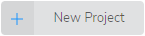
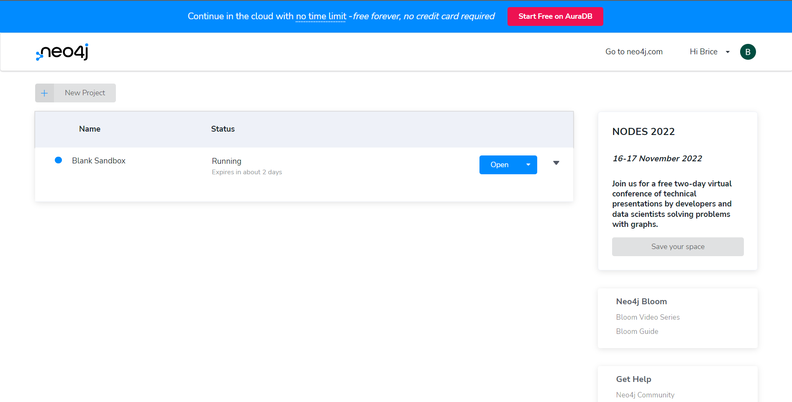
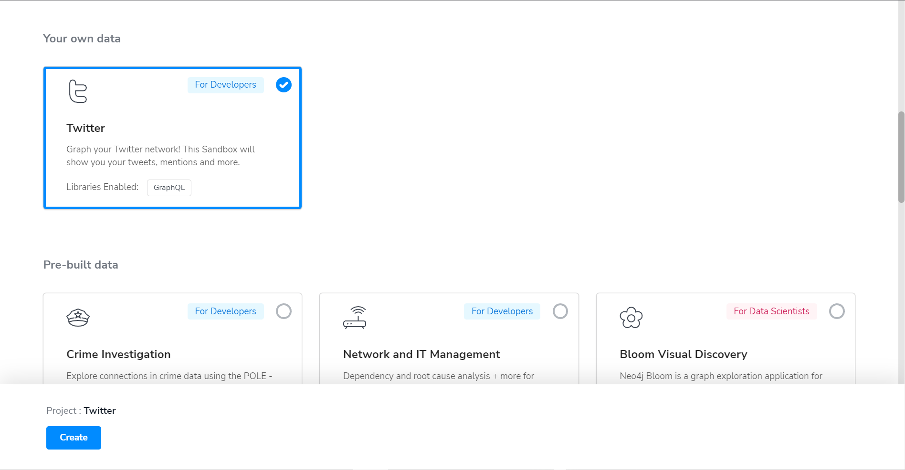
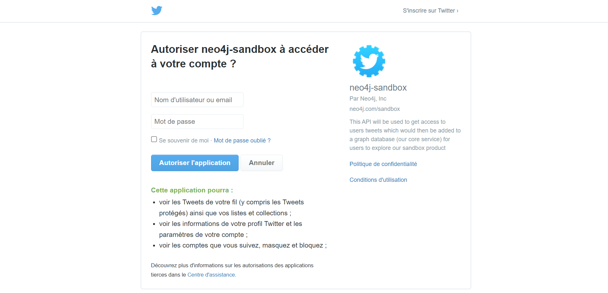
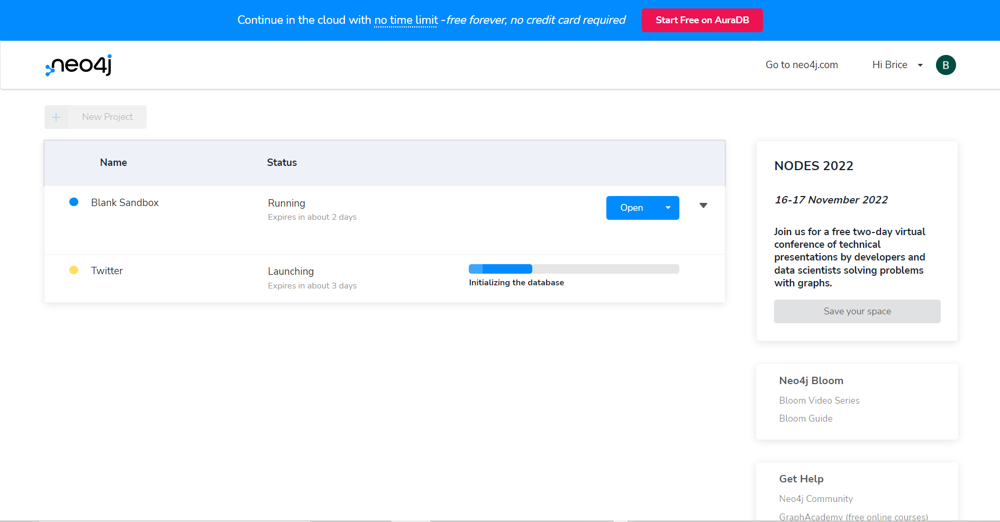
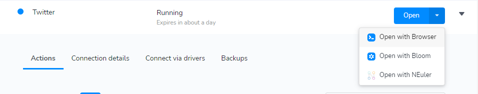
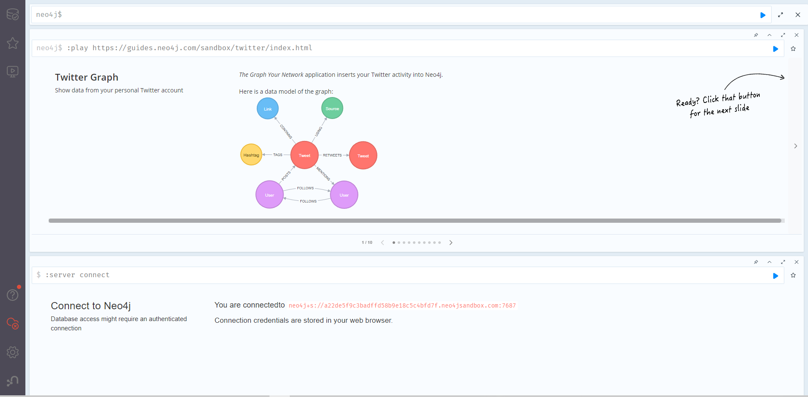

# Twitter Graph
[](README.md)

Dans ce TP, nous allons analyser nos interactions sur Twitter, car les réseaux sociaux sont un très bon cas d'usage pour les bases de données de type graphe.

Au programme, nous allons :
- Explorer nos comptes Twitter 
- Trouver les personnes qui ne nous **"FOLLOW BACK"** pas 


Nous allons utiliser pour ce TP, Neo4j sandbox. Il est donc important d'avoir créé un compte via ce lien : https://sandbox.neo4j.com/.

Une fois votre compte créé, nous allons créer un projet. 

Cliquer sur 


Aller dans la section "Your own data", sélectionner **Twitter** et cliquer sur **Create**.


Ensuite, autorisez l'accès à votre compte Twitter en renseignant vos identifiants, puis cliquer sur "Autoriser l'application"



Une fois l'application, vos données Twitter vont commencer à être chargées dans votre projet.



Une fois le chargement terminé, cliquer sur le bouton "Open with Browser"



L'interface Neo4j Browser va s'ouvrir et vous pouvez commencer à exécuter les requêtes préparées.



Notez vos résultats et commentez-les.

Exécutez la requête suivante pour trouver les personnes qui ne vous **FOLLOW BACK** pas.
```CYPHER
MATCH
    (me:User:Me)-[:FOLLOWS]->(f)
WHERE
    NOT (f)-[:FOLLOWS]->(me)
RETURN
    f.name, f.following, f.followers
ORDER BY
    f.followers DESC
```